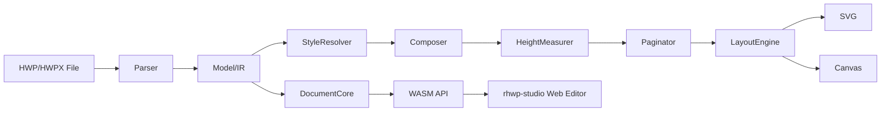

# rhwp Development Roadmap

**"An open-source alternative to Hancom's web HWP"**

## Status Summary (As of March 24, 2026)

### Project Identity

A **HWP web viewer/editor engine** based on Rust + WebAssembly + Canvas.
An **MIT-licensed open-source alternative** to Hancom's WebHangul (Web HWP).

### Achievement Status

| Area | Status | Coverage |
|------|--------|---------|
| HWP 5.0 Parsing | Complete | 95% |
| HWPX Parsing | Complete | 80% |
| Rendering (SVG/Canvas) | Complete | 90% |
| Pagination | Complete | 85% |
| Equation Rendering | Complete | 90% |
| Header/Footer/Master Page | Complete | 90% |
| Multi-column Layout | Complete | 85% |
| Text Editing | Complete | 70% |
| Table Editing | Complete | 70% |
| Web Editor UI | Complete | 60% |
| HWP Serialization (Save) | Complete | 90% |
| WASM Build | Complete | 100% |

### Scale

| Metric | Value |
|--------|-------|
| Rust Code | 133,000 lines |
| Tests | 727 (unit + integration) |
| E2E Scenarios | 12 (Puppeteer/CDP) |
| Tasks Completed | 355 |
| Code Reviews | 4th round (8.9/10) |

---

## Overall Timeline

```
2026
──────────────────────────────────────────────────────────
Jan-Mar       Foundation: Engine Construction           <- Done
              |- HWP/HWPX Parser
              |- Rendering Engine (SVG/Canvas)
              |- Pagination Engine
              |- Equation Parser/Renderer
              |- Web Editor (rhwp-studio)
              +- Debug Tools + E2E Tests

April         Phase 1: hwpctl Compatibility Layer       <- Current
              |- hwpctl API-compatible JavaScript wrapper
              |- Core APIs: TableCreation, ShapeObject, etc.
              |- Zero-change migration from existing WebGian code
              +- hwpctl compatibility test suite

May           Phase 2: GitHub Release Preparation
              |- Achieve code quality score of 9.2
              |- Remove sensitive information
              |- CONTRIBUTING.md + README.en.md
              |- Issue/PR templates
              +- MIT license adoption

June          Phase 3: Public Release + Community Launch
              |- GitHub public release
              |- Demo site deployment
              |- npm package publishing
              |- crates.io publishing
              +- Technical blog posts (Korean/English)

Jul-Sep       Phase 4: Advanced Editor Features
              |- Undo/Redo
              |- Clipboard (Copy/Cut/Paste)
              |- Find/Replace
              |- Drawing tools
              +- Printing (window.print / PDF)

Oct-Dec       Phase 5: Ecosystem Expansion
              |- HWP->PDF conversion (CLI)
              |- REST API server (document conversion service)
              |- Plugin architecture
              +- i18n (English UI)
──────────────────────────────────────────────────────────
```

---

## Phase 1: hwpctl Compatibility Layer (April)

**Goal**: Implement a JavaScript wrapper compatible with Hancom WebGian's hwpctl API

### 1-0. hwpctl Compatible API

Provide the same interface as Hancom WebGian's `hwpctl` API,
enabling **zero-change** migration of existing WebGian code to rhwp.

**Reference document**: `mydocs/manual/hwpctl/hwpctl_ParameterSetID_Item_v1.2.md`

**Implementation priority**:

| Priority | hwpctl API | Description |
|----------|-----------|-------------|
| P0 | `CreateSet("Table")` + `InsertCtrl` | Table creation |
| P0 | `TableCreation` (Rows, Cols, ColWidth, WidthType) | Table parameters |
| P0 | ShapeObject common (TreatAsChar, TextWrap, VertRelTo, HorzRelTo) | Object placement |
| P1 | `TableInsertLine` / `TableDeleteLine` | Add/delete rows/columns |
| P1 | `TableSplitCell` | Split cells |
| P1 | `Header` / `Footer` / `MasterPage` | Header/Footer/Master page |
| P2 | `TableStrToTbl` | String-to-table conversion |
| P2 | `EqEdit` | Equation insertion |
| P2 | `DrawImageAttr` | Image insertion |

**Implementation approach**: JavaScript compatibility wrapper in `rhwp-studio/src/hwpctl/` module

```javascript
// Hancom hwpctl compatible interface
const hwpCtrl = new RhwpCtrl(wasmModule);
const tableSet = hwpCtrl.CreateSet("Table");
tableSet.SetItem("Rows", 10);
tableSet.SetItem("Cols", 6);
tableSet.SetItem("TreatAsChar", false);
tableSet.SetItem("TextWrap", 1);
hwpCtrl.InsertCtrl("Table", tableSet);
```

---

## Phase 2: GitHub Release Preparation (May)

**Goal**: Code quality 9.2 + complete documentation + sensitive information removal

### 2-1. Code Quality Target (8.9 -> 9.2)

| Item | Current | Target | Work |
|------|---------|--------|------|
| SOLID-S | 8.5 | 9.0 | layout_column_item decomposition done (Task 349) |
| Testing | 7.5 | 8.0 | 11 integration tests added (Task 351) |
| Code Quality | 8.5 | 9.0 | Clippy 28->8, From standardization (Task 350) |
| Technical Debt | 8.5 | 9.0 | Dependency removal, unwrap elimination (Task 346-348) |

### 2-2. Sensitive Information Removal

| Item | Location | Action |
|------|----------|--------|
| GitLab password | CLAUDE.md | Remove or .gitignore |
| SSH key path | CLAUDE.md | Remove |
| Internal server IP | CLAUDE.md | Remove |
| Internal file paths | CLAUDE.md, various docs | Clean up |

### 2-3. Public Documentation

| Document | Status | Content |
|----------|--------|---------|
| README.md | Done | Features, build, CLI, architecture |
| README.en.md | Not written | English README |
| CONTRIBUTING.md | Not written | Contribution guide (branching, coding conventions, PR rules) |
| LICENSE | Not written | MIT license |
| onboarding_guide.md | Done | Debugging protocol, feedback system |
| .github/ISSUE_TEMPLATE | Not written | Bug report, feature request templates |
| .github/PULL_REQUEST_TEMPLATE | Not written | PR checklist |

### 2-4. Architecture Diagram

Add Mermaid.js diagram to README:



---

## Phase 3: Public Release + Community Launch (June)

**Goal**: Gain initial traction after GitHub public release

### 3-1. GitHub Public Release

- Repository: `github.com/[org]/rhwp`
- License: MIT
- Included: Core engine + WASM + rhwp-studio + mydocs (development records)
- Excluded: Internal configurations, sensitive information

### 3-2. Demo Site

- Deploy rhwp-studio on GitHub Pages or Vercel
- Load sample HWP files and view instantly in the browser
- URL: `rhwp.dev` or `[org].github.io/rhwp`

### 3-3. Package Publishing

| Package | Registry | Contents |
|---------|----------|---------|
| `rhwp` | crates.io | Rust core library |
| `@rhwp/wasm` | npm | WASM bindings |

### 3-4. Technical Blog

| Topic | Language | Audience |
|-------|----------|----------|
| "Parsing the HWP Binary Format in Rust" | Korean | Korean developers |
| "Building an HWP Word Processor in Rust + WASM" | English | Global |
| "Building a 130K-Line Project Through AI-Human Pair Programming" | Korean/English | AI dev community |
| "Implementing an HWP Equation Script Parser with Recursive Descent" | Korean | Compiler enthusiasts |

### 3-5. Initial Exposure Channels

| Channel | Strategy |
|---------|----------|
| GeekNews (Korea) | "Open-source alternative to Hancom's web HWP -- Rust + WASM" |
| Hacker News | "Show HN: Open-source HWP word processor in Rust + WASM" |
| Reddit r/rust | Highlight WASM + Canvas tech stack |
| X (Twitter) | Demo GIF + thread |

---

## Phase 4: Advanced Editor Features (July-September)

**Goal**: Reach practical usability as a web editor

### 4-1. Editing Features

| Feature | Priority | Notes |
|---------|----------|-------|
| Undo/Redo | High | Command pattern based |
| Find/Replace | High | Regex support |
| Drawing tools (line, rectangle, circle) | Medium | Leveraging Shape model |
| Text box insert/edit | Medium | TextBox control |
| Image insertion (drag & drop) | Medium | BinData + Picture |
| Table style presets | Low | Border/background combinations |

### 4-2. Rendering Improvements

| Item | Current | Target |
|------|---------|--------|
| Chart rendering | Not implemented | Basic charts (bar/pie/line) |
| Footnote/Endnote rendering | Partial | Complete |
| Change tracking (revision) | Not implemented | Viewer level |
| Duplex print preview | Not implemented | Even/odd pages |

### 4-3. Printing

| Method | Description |
|--------|-------------|
| window.print() | Browser default printing (CSS @media print) |
| PDF export | Canvas -> PDF (jsPDF or server-side) |

---

## Phase 5: Ecosystem Expansion (October-December)

### 5-1. HWP->PDF Conversion (CLI)

```bash
rhwp export-pdf sample.hwp output.pdf
```

Leveraging existing SVG rendering -> `svg2pdf` or direct PDF generation.

### 5-2. REST API Server

```
POST /api/convert/hwp-to-pdf
POST /api/convert/hwp-to-svg
POST /api/render/{page}
GET  /api/info
```

Deployed as a Docker image. Used as an enterprise document conversion service.

### 5-3. Plugin Architecture

- Custom renderers (PDF, PNG, etc.)
- Custom parsers (DOC, DOCX, etc.)
- Editor extensions (spell check, translation, etc.)

---

## Outstanding Technical Issues

| No | Item | Status | Notes |
|----|------|--------|-------|
| 340 | Bullet paragraph tab alignment | Open | Bullet width included in tab grid reference |
| B-002 | Pagination vpos synchronization | Open | 2 existing tests need modification |

---

## Differentiators

### vs Hancom WebHangul

| Item | Hancom WebHangul | rhwp |
|------|-----------------|------|
| License | Commercial (paid) | MIT (free) |
| Tech Stack | Java/ActiveX based | Rust + WASM + Canvas |
| Source Code | Proprietary | Open source |
| Customization | Not possible | Fully flexible |
| Browser Compatibility | IE/Chrome plugin dependent | All modern browsers |
| Server Dependency | Requires Hancom server | Client-only operation |

### vs Existing Open-Source HWP Projects

| Item | libhwp/hwp.js/pyhwp | rhwp |
|------|---------------------|------|
| Parsing | Partial HWP5 | HWP5 + HWPX |
| Rendering | None or basic | Pagination + multi-column + equations |
| Editing | None | Text/table/formatting editing |
| Web Editor | None | rhwp-studio (Canvas) |
| Tests | Few | 727 + 12 E2E |
| Codebase | Few thousand lines | 133,000 lines |

### Technical Innovation

| Item | Description |
|------|-------------|
| **AI Pair Programming** | Entire development through Claude Code + human collaboration -- full development records published |
| **Debugging Protocol** | `--debug-overlay` + `dump-pages` + `dump` -- quantitative coordinate-based communication |
| **Code Quality Dashboard** | Clippy + CC + tests + trend charts -- automated monitoring |
| **HWP Spec Error Documentation** | Discovered official spec errors and verified with actual binaries -- community asset |
| **Equation Renderer** | 30+ Hancom equation script commands implemented with recursive descent parser |

---

## Success Metrics

### Phase 3 (1 month after release)

| Metric | Target |
|--------|--------|
| GitHub Stars | 200+ |
| npm Weekly Downloads | 50+ |
| Issue/PR Participants | 5+ |
| Demo Site Visits | 1,000+/month |

### Phase 4 (3 months after release)

| Metric | Target |
|--------|--------|
| GitHub Stars | 1,000+ |
| Contributors | 10+ |
| Forks | 50+ |
| Enterprise Inquiries | 3+ |

### Long Term (12 months)

- "Open-source HWP = rhwp" becomes common knowledge in the Korean developer community
- Secure real-world usage cases at government agencies and enterprises as a web viewer

---

*Written: 2026-03-24*
*Previous roadmap: dev_roadmap_v1_backup.md (written 2026-02-10, focused on AI Agent tooling)*
