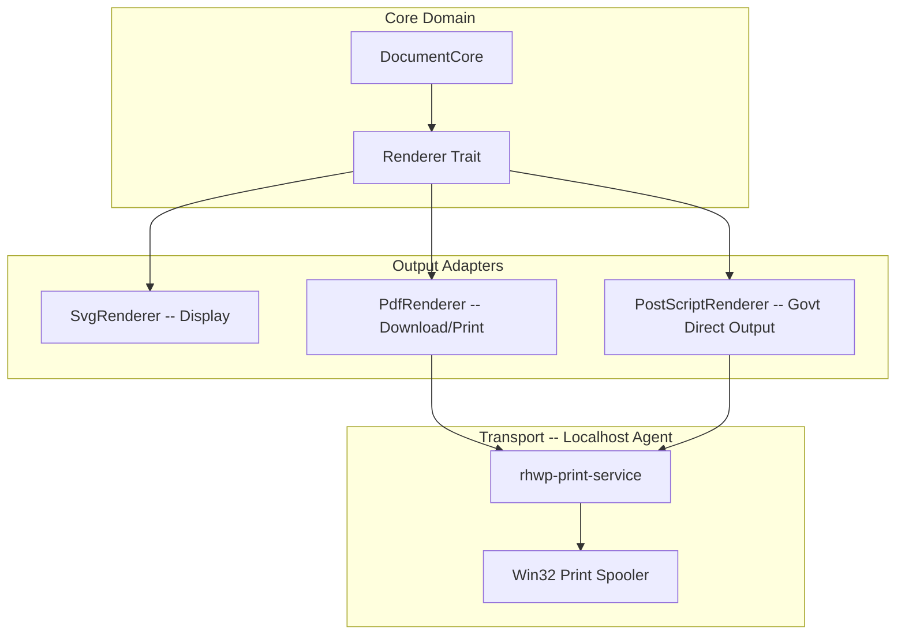

# Technical Guideline: rhwp Direct Printing Architecture

> **Audience**: rhwp development team, architecture team
> **Purpose**: Design guide for achieving desktop-grade printing experience within the browser
> **Date**: 2026-02-23
> **Revision**: 2026-02-23 (v2 -- PDF-based + Localhost Agent strategy reflected)
> **Detailed development plan**: `mydocs/plans/task_B009.md`

---

## 1. Architecture Vision

Current web-based printing approaches (window.print or PDF download) require **8-10 steps of user interaction and 2 application switches**. Competitors (Hancom WebGian, Polaris, etc.) also remain at the PDF download level.

rhwp **directly generates PDF/PostScript from the Core Engine** and **completes printing within the browser via a Localhost Agent**. The user simply presses Ctrl+P -> selects printer -> prints, **done in 3 steps**.

```
Competitors: Document -> PDF download -> Open file -> Print from PDF viewer  (8-10 steps)
rhwp:        Document -> [Print] -> Select printer -> Output complete         (3 steps)
```

## 2. Design Principles

1. **PDF is the foundation**: A single PDF Renderer solves both download and printing. This is a feature that needs to be built anyway.
2. **PS is the advanced path**: For government network printers (all PS-capable), bypass the driver and output directly.
3. **Localhost Agent**: Adopt a pattern already proven in Korea as an ActiveX replacement (Yessign, TouchEn nxKey, etc.).
4. **Platform-independent core**: PDF/PS generation is finalized inside WASM. The Agent is merely the transport layer.
5. **Graceful fallback**: When Agent is not installed, naturally fall back to PDF download.

## 3. Print Paths

### 3.1 Dual-Path Architecture

```
                    +-------------+
                    | Core Engine |
                    | (Rust/WASM) |
                    +------+------+
                           |
                    PageRenderTree
                           |
                    Renderer Trait
                           |
              +------------+------------+
              |            |            |
         SvgRenderer  PdfRenderer  PostScriptRenderer
         (display)   (basic P1)   (advanced P2)
              |            |            |
              v         Vec<u8>      Vec<u8>
         Browser view      |            |
                    +------+------+     |
                    |            |      |
               [Download]   [Print]    |
               Blob save    |          |
                           v          v
                    +---------------------+
                    |  rhwp-print-service  |
                    |  (Localhost Agent)   |
                    |  https://localhost   |
                    +----------+----------+
                               |
                         Win32 Spooler
                               |
                           Printer Output
```

### 3.2 Print Paths by Target Environment

| Target Environment | Print Path | Notes |
|--------------------|-----------|-------|
| **Government (internal network)** | PS RAW -> Agent -> Spooler | Optimal path. Driver bypass, all govt network printers support PS |
| **General Enterprise** | PDF -> Agent -> Spooler (via driver) | Universal compatibility |
| **Individual Users** | PDF download | Fallback when Agent not installed |
| **macOS / Linux** | PDF download or browser print | Future CUPS Agent expansion possible |

### 3.3 PS RAW vs PDF via Driver Comparison

| | PDF -> Spooler | PS RAW -> Spooler |
|---|---|---|
| Driver Dependency | Yes (driver rasterizes) | **None** (printer interprets directly) |
| Output Quality | Depends on driver quality | **Core Engine has 100% control** |
| Speed | Includes driver conversion | Printer processes directly (faster) |
| Compatibility | Nearly all printers | PS-capable printers (all govt network printers qualify) |
| Security Watermark | Possible tampering after driver processing | **PS-level insertion, tamper-proof** |

## 4. Hexagonal Architecture Integration

Implemented as the `Adapter` layer from Task 149 (Hexagonal Architecture).



### Renderer Trait (existing, no changes)

```rust
pub trait Renderer {
    fn begin_page(&mut self, width: f64, height: f64);
    fn end_page(&mut self);
    fn draw_text(&mut self, text: &str, x: f64, y: f64, style: &TextStyle);
    fn draw_rect(&mut self, x: f64, y: f64, w: f64, h: f64, corner_radius: f64, style: &ShapeStyle);
    fn draw_line(&mut self, x1: f64, y1: f64, x2: f64, y2: f64, style: &LineStyle);
    fn draw_ellipse(&mut self, cx: f64, cy: f64, rx: f64, ry: f64, style: &ShapeStyle);
    fn draw_image(&mut self, data: &[u8], x: f64, y: f64, w: f64, h: f64);
    fn draw_path(&mut self, commands: &[PathCommand], style: &ShapeStyle);
}
```

The 7 methods map directly to PDF/PS operators. Since the SVG Renderer's vector paths are already abstracted through this trait, a new Renderer implementation only needs to change the output format.

## 5. Localhost Agent Architecture

### 5.1 A Proven Pattern in the Korean IT Ecosystem

After ActiveX became no longer viable, the Korean IT industry adopted the **Localhost Agent pattern** as the standard replacement. This architecture has been deployed and proven on millions of PCs.

| Domain | Solution | Same Pattern |
|--------|----------|-------------|
| Digital Certificates | Yessign, CrossCert | localhost HTTPS -> certificate signing |
| Keyboard Security | TouchEn nxKey | localhost HTTPS -> keypress encryption |
| Security Software | AhnLab Safe Transaction | localhost HTTPS -> process protection |
| Print Security | SafePrint, MarkAny | localhost -> print monitoring/approval |

rhwp-print-service uses the same structure and provides an installation/usage experience that is already familiar to users.

### 5.2 Communication Structure

```
[Browser rhwp-studio]                [rhwp-print-service]
       |                                      |
       |  GET /check  (installation/version)  |
       |------------------------------------> |
       |  <- { version, status }              |
       |                                      |
       |  GET /printers  (printer list)       |
       |------------------------------------> | EnumPrintersW()
       |  <- [{ name, driver, status }, ...]  |
       |                                      |
       |  POST /print  (send print job)       |
       |  { printer, data, dataType }         |
       |------------------------------------> | OpenPrinterW()
       |                                      | WritePrinter()
       |  <- { jobId, status }                |
       |                                      |
       |  GET /job/{id}  (status query)       |
       |------------------------------------> |
       |  <- { status, progress }             |
```

### 5.3 Security Design

| Item | Method |
|------|--------|
| Block External Access | Bind to 127.0.0.1 only |
| TLS | Self-signed certificate (Root CA registered at install) |
| CSRF Prevention | Origin header validation (only allow rhwp-studio origin) |
| Printer Isolation | WTSQueryUserToken -> Impersonation (access only user session's printers) |
| Request Throttling | Rate Limiting |

### 5.4 Deployment

| Item | Method |
|------|--------|
| Installation Package | MSI (WiX Toolset) |
| Large-scale Deployment | GPO deployment support (government standard) |
| Auto-update | Version comparison from `/check` response -> update notification |
| Non-installed Fallback | PDF download (no feature loss, only UX difference) |

## 6. Selection Guide: Zero-Install vs Agent-based

| Comparison | Zero-Install (PDF Download) | Agent-based (Localhost Agent) |
| :--- | :--- | :--- |
| **Installation Required** | **None** | One-time install (MSI) |
| **User Experience** | 8-10 steps, 2 app switches | **3 steps, 0 app switches** |
| **Printer Compatibility** | Depends on OS default PDF viewer | All Windows printers (including legacy) |
| **Direct PS Output** | Not possible | **Possible (driver bypass)** |
| **Security Watermark** | PDF level (viewer dependent) | **PS level (tamper-proof)** |
| **Security Constraints** | Affected by browser policies | Local privileges (no constraints) |
| **Primary Target** | Individual users, non-install environments | **Government, finance, air-gapped networks** |

> In government environments, Agent-based is **mandatory**. Direct PS RAW transmission to network-registered printers is possible, and since it uses the same architecture as existing print security solutions (SafePrint, etc.), it naturally coexists with existing security infrastructure.

## 7. Secure Printing (Government)

### 7.1 Security Watermarks

The Core Engine directly inserts watermarks during PDF/PS generation. No separate security solution is needed.

- **PS-level insertion**: PostScript commands directly generate semi-transparent text on each page
- **PDF-level insertion**: Watermark graphic operators inserted into Content Stream
- **Content**: Username, print date/time, security classification, document management number

### 7.2 Banner Page (Cover Sheet)

A cover page with security-regulation-compliant information is directly generated at the data level at the beginning of the document.

### 7.3 Job Ticket

Metadata (user ID, security classification, department information) is included in the print job to support audit trails.

## 8. Phased Roadmap

| Phase | Content | Key Deliverable |
|-------|---------|----------------|
| **1. PDF Renderer** | Renderer trait -> PDF binary generation | `src/renderer/pdf.rs` |
| **2. PS Renderer** | Renderer trait -> PostScript generation | `src/renderer/postscript.rs` |
| **3. Windows Agent** | Localhost HTTPS + Win32 Spooler API | `rhwp-print-service/` |
| **4. Browser Integration** | Print dialog + Agent communication + fallback | `rhwp-studio/src/print/` |
| **5. Secure Printing** | Watermark, Banner Page, GPO deployment | Meet government requirements |

> For detailed phased plans, see `mydocs/plans/task_B009.md`.

## 9. Competitive Advantage Summary

```
Government Procurement Technical Evaluation:

  [ ] Printing          Competitor: "PDF export"      rhwp: "Direct in-browser printing"
  [ ] Secure Printing   Competitor: "Separate solution" rhwp: "Built-in"
  [ ] Driver Compat     Competitor: "User resolves"    rhwp: "PS RAW driver bypass"
  [ ] Desktop Parity    Competitor: "Limited features"  rhwp: "Same experience as desktop"
```

---

> [!IMPORTANT]
> This guideline is a **key differentiator** that creates a technical gap with Hancom WebGian.
> The goal is to achieve **"It's web-based, but better than desktop"** for printing,
> and the combination of PDF Renderer (foundation) + PostScript Renderer (differentiation) +
> Localhost Agent (transport) makes this possible.
